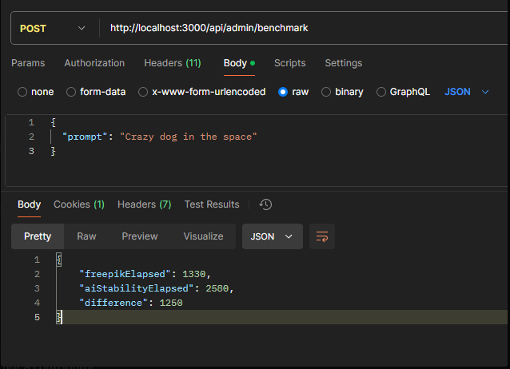

## Setup

```bash
# create a firebase project and copy AccountKey.json to the src/config folder

# copy .env.example to .env
$ cp .env.example .env

# fill out the variables required from firebase project settings

```

## Run Project

```bash

# with docker
$ docker build -t image-generation-api .
$ docker run -p 3000:3000 image-generation-api

# install node modules with npm or yarn
$ npm install

# start the dev application
$ npm run start
```

## Project overview

```

- using cookie for better security rather than auth Token

- firebase authentication and role based authentication

- seeding for admin user
  email: "superadmin@gmail.com",
  password: "admin123",

- New user can't use each service until admin grant access

- Admin can grant access for each effect to user

    enum AccessLevel {
      TEXT_TO_IMAGE = "text-to-image",
      REMOVE_BACKGROUND = "remove-background",
      UPSCALE = "upscale",
      TEXT_TO_IMAGE_AI_STABILITY = "text-to-image-ai-stability",
    }

```

| method | resource                     | description                                                     |
| :----- | :--------------------------- | :-------------------------------------------------------------- |
| `POST` | `/auth/login`                | login user                                                      |
| `POST` | `/auth/register`             | register user                                                   |
| `POST` | `/admin/grant-access`        | grant service access to user                                    |
| `POST` | `/admin/remove-access`       | remove service access to user                                   |
| `POST` | `/admin/benchmark`           | benchmark to compare the image generation speed of the services |
| `POST` | `/service/text-to-image`     | text to image effect                                            |
| `POST` | `/service/remove-background` | remove background effect                                        |
| `POST` | `/service/upscale`           | upscale effect                                                  |

```

Middlewares used for authentication and authorization

- auth middleware
- role middleware (for admin only)
- service middleware (for service permission granted by admin)

```

## Benchmark

ai-stability-serivce's api key has credit limit so should heck the credit limit before using the service or please create new one

After comparing Freepik and Stability AI services, I decided to go with Freepik. It offers superior quality and faster performance. Additionally, Freepik provides a wider range of effect options to choose from.


```

```
